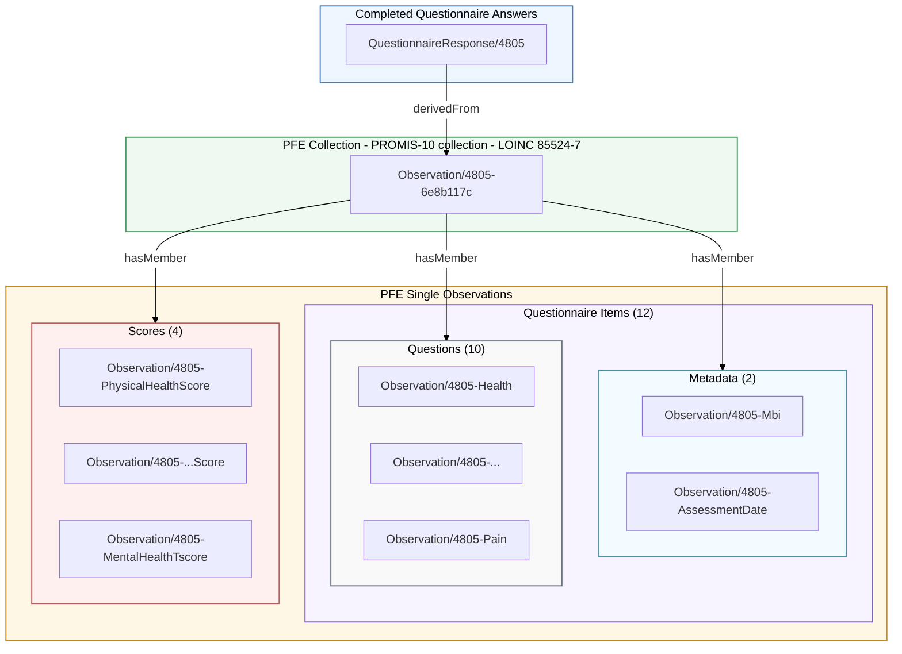

This page shows how one PROMIS-10 QuestionnaireResponse (QR) is represented as a set of derived FHIR Observation resources in the PACIO sample data. The example uses `QuestionnaireResponse/4805` for Betsy Smith-Johnson.

> **Contributor note:** Before creating or updating sample data, review the [Examples Style Guide](style_guide.html), [Synthetic Persona Overview](synthetic_personas.html), and [AI-Assisted Contributor Guidance](ai_assisted_contributor_guidance.html) if appropriate. Contributors should make minimal changes to existing sample data and avoid broad cleanup, unrelated renaming, reformatting, duplicate narrative content, or clinical rewrites to existing data unless specifically requested.

### Source Resources

| Resource | Id | Local file |
|---|---|---|
| Questionnaire | `Questionnaire/questionnaire-PROMIS10` | `original/questionnaire-questionnaire-PROMIS10.json` |
| QuestionnaireResponse | `QuestionnaireResponse/4805` | `original/questionnaire-response-4805.json` |
| Derived Observation Bundle | 17 Observations | `original/observations-derived-from-qr-4805-bundle.json` |

### Conversion Summary

The QR is converted into one parent collection Observation and 16 member Observations.

| Observation grouping | Count | Description |
|---|---:|---|
| Collection | 1 | Parent Observation for the PROMIS-10 instrument result. |
| Questionnaire metadata | 2 | Context fields included in the Questionnaire but not part of the ten PROMIS-10 answers. |
| Questionnaire questions | 10 | The ten PROMIS-10 answered items. |
| Scores | 4 | Raw and T-score Observations for global physical and mental health. |
| Total | 17 | All Observations derived from `QuestionnaireResponse/4805`. |

### Conversion Diagram



### Questionnaire

These resources are grouped first by their inclusion in the Questionnaire.

#### Metadata

| QR linkId | Observation | Questionnaire item type | Code | Value |
|---|---|---|---|---|
| `mbi` | `Observation/4805-Mbi` | `string` | `mbi` | `1PA3D58WH16` |
| `assessment_date` | `Observation/4805-AssessmentDate` | `date` | `assessment_date` | `2026-01-13` |

#### Questions

| QR linkId | Observation | LOINC | Answer |
|---|---|---|---|
| `health` | `Observation/4805-Health` | `61577-3` | Fair (`LA8968-5`, ordinal 2) |
| `quality_of_life` | `Observation/4805-QualityOfLife` | `61578-1` | Good (`LA8967-7`, ordinal 3) |
| `physical_health` | `Observation/4805-PhysicalHealth` | `61579-9` | Good (`LA8967-7`, ordinal 3) |
| `mental_health` | `Observation/4805-MentalHealth` | `61580-7` | Very Good (`LA13913-1`, ordinal 4) |
| `satisfaction_social` | `Observation/4805-SatisfactionSocial` | `61581-5` | Very Good (`LA13913-1`, ordinal 4) |
| `social_activities` | `Observation/4805-SocialActivities` | `61585-6` | Good (`LA8967-7`, ordinal 3) |
| `physical_activities` | `Observation/4805-PhysicalActivities` | `61582-3` | Mostly (`LA13938-8`, ordinal 4) |
| `emotional` | `Observation/4805-Emotional` | `61586-4` | Sometimes (`LA10082-8`, ordinal 3) |
| `fatigue` | `Observation/4805-Fatigue` | `61584-9` | Mild (`LA6752-5`, ordinal 4) |
| `pain` | `Observation/4805-Pain` | `61583-1` | 3 (`LA6114-8`, ordinal 3) |

### Scores

These score fields are included in the Questionnaire but are grouped separately from the ten PROMIS-10 answer items.

| QR linkId | Observation | LOINC | Value |
|---|---|---|---:|
| `physical_health_score` | `Observation/4805-PhysicalHealthScore` | `71972-4` | 15 |
| `physical_health_tscore` | `Observation/4805-PhysicalHealthTscore` | `71971-6` | 47.7 |
| `mental_health_score` | `Observation/4805-MentalHealthScore` | `71970-8` | 14 |
| `mental_health_tscore` | `Observation/4805-MentalHealthTscore` | `71969-0` | 48.3 |

### Collection Observation

`Observation/4805-6e8b117c` is the parent collection Observation. It uses LOINC `85524-7` (`PROMIS short form - global - version 1.2`) and includes 16 `hasMember` references: the 2 metadata Observations, the 10 answer Observations, and the 4 score Observations.

Each member Observation also points back to the source QR with:

```json
"derivedFrom": [
  {
    "reference": "QuestionnaireResponse/4805"
  }
]
```

### Notes

This page is intended as a single worked example to explain the resource relationships, not a generalized rule for all questionnaires. The grouping shown here is based on the structure of this PROMIS-10 Questionnaire, QuestionnaireResponse, and derived Observation set. This example is structured in the following ways:

- Metadata items are Questionnaire items used as context for the assessment.
- Questions are the ten PROMIS-10 answer items.
- Scores are the calculated raw and T-score values included in the Questionnaire.
- The collection Observation groups the metadata, answer, and score Observations into one instrument-level result.